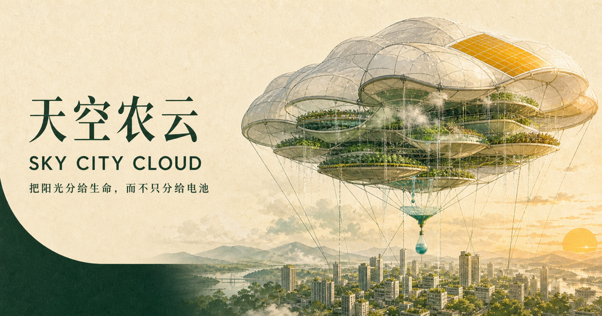

# 天空农云 / Sky City Cloud



天空农云是一项开放式未来城市基础设施研究：用可系留、可回收、可模块化的空中农业与遮阳单元，把入射阳光优先分配给作物生长、蒸腾冷却和水热循环，只保留必要的控制电力。

它不是一座等待建成的“漂浮城市”，而是一组可以逐步证伪的工程假设。

## 核心问题

> 如果不把“发电量最大化”设为唯一目标，作物、阴影、蒸腾、水热回收与少量控制电力之间，能否找到更高的系统总收益？

第一版网站提供：

- 中英双语概念说明
- 可调面积、辐照度和四向分配的能量沙盘
- 系留云幕、悬挂农业舱、自持生态单元三种工程形态
- 风、水重量、极端天气、空域与阳光权风险清单
- 从地面材料试验到城市数字孪生的开放路线图
- 研究问题、工程提案和试点场地贡献入口

## 本地运行

需要 Node.js 22.13 或更高版本。

```bash
npm install
npm run dev
```

构建和测试：

```bash
npm run build
npm test
```

## 如何参与

从 [Issues](https://github.com/zhouxiansheng007007/sky-city-cloud/issues) 开始：

- 提出一个可测量的科学问题
- 质疑模型中的假设或量纲
- 提交作物、材料、风载、水热或城市气候数据
- 描述一个可安全回收的结构方案
- 提名一个远离核心空域的试点场地

提交代码前请阅读 [CONTRIBUTING.md](CONTRIBUTING.md)。项目计划见 [ROADMAP.md](ROADMAP.md)，技术边界见 [docs/CONCEPT.md](docs/CONCEPT.md)。

## 研究边界

网站中的计算器只提供物理量级，不代表作物产量、城市降温幅度、经济回报或可施工性。所有关键指标都必须通过气候、作物、材料和结构的现场实验校准。

## License

Apache License 2.0。详见 [LICENSE](LICENSE)。
